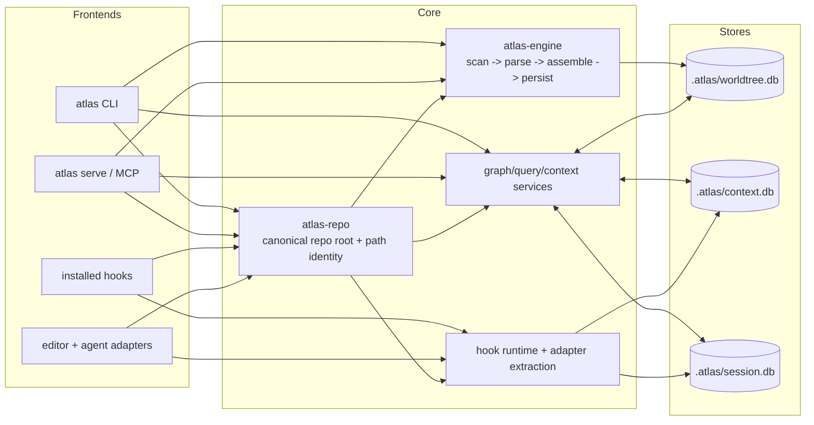

# Atlas Architecture

Atlas keeps graph facts, large artifacts, and session state in separate SQLite files under `.atlas/`. CLI commands, MCP tools, and installed hooks all flow through same core services so repo identity, canonical paths, and storage boundaries stay consistent.

## High-level diagram

## Database roles

### `.atlas/worldtree.db`

Purpose: static repository graph facts.

- file inventory and canonical repo-relative paths
- symbols, edges, ownership, and graph-derived diagnostics
- build/update lifecycle state for graph-backed features

Do not store:

- raw hook payload dumps
- large command output
- session timelines
- prompt/runtime artifact bodies

Writers:

- `atlas-engine::build_graph()`
- `atlas-engine::update_graph()`
- graph maintenance flows such as migrations and postprocess steps

Readers:

- CLI graph commands
- MCP graph/context/review tools
- impact, review, and query services

### `.atlas/context.db`

Purpose: large artifacts and searchable saved context.

- command output previews and pointer-backed payloads
- hook payload artifacts
- saved context chunks and retrieval text
- runtime artifacts too large for session rows

Why separate:

- large text should not bloat graph tables
- retention and chunking policy differ from graph facts
- searchable artifact text can evolve without changing graph schema

### `.atlas/session.db`

Purpose: bounded event ledger and resume continuity.

- session identities
- event metadata and compact payloads
- resume snapshots
- references into `context.db` for large artifacts

Why separate:

- session continuity should survive even when graph is stale
- event retention differs from graph rebuild lifecycle
- session writes are best-effort and must not reshape graph schema

## Atlas-engine pipeline

`atlas-engine` owns graph construction and incremental update. Current flow:

1. Resolve canonical repo root and tracked file set.
2. Read files and parse source in parallel.
3. Assemble nodes, edges, and ownership relationships in memory.
4. Persist graph facts into `worldtree.db` in sequential SQLite write phases.
5. Return build/update summaries for CLI and MCP surfaces.

Important boundary:

- parallel parse phases stay outside SQLite write phases
- path identity comes from `atlas-repo`, not per-command helpers
- graph build/update writes only `worldtree.db`

## Query and context pipeline

Graph-aware queries and review/context commands read from multiple stores, but with distinct roles:

1. resolve canonical repo path or symbol identity
2. read graph facts from `worldtree.db`
3. optionally merge saved artifacts from `context.db`
4. optionally merge session hints from `session.db`
5. emit bounded response to CLI or MCP caller

This keeps retrieval/ranking flexible without turning runtime text into graph truth.

## Adapter and hook boundaries

Adapters and hooks are input surfaces, not alternate storage engines.

- installed hooks read payloads from stdin, sanitize and redact them, then persist through CLI hook runtime
- hook runtime may store large payload bodies in `context.db`
- hook runtime records bounded event metadata in `session.db`
- hooks do not write `worldtree.db` directly
- adapters and MCP surfaces reuse same canonical repo and path rules as CLI

Operational rule:

- graph facts enter through build/update services
- runtime artifacts enter through content/session services
- frontends may enrich context, but must not bypass store boundaries

## Failure isolation

Store split exists so one subsystem can degrade without corrupting others.

- corrupt or stale graph state should block graph-backed answers, not destroy session history
- large artifact routing failures should reduce enrichment quality, not rewrite graph facts
- session persistence failure should not change repository graph identity

## Mental model

Use `worldtree.db` for code truth, `context.db` for large text, and `session.db` for continuity. Frontends differ. Storage contract does not.
