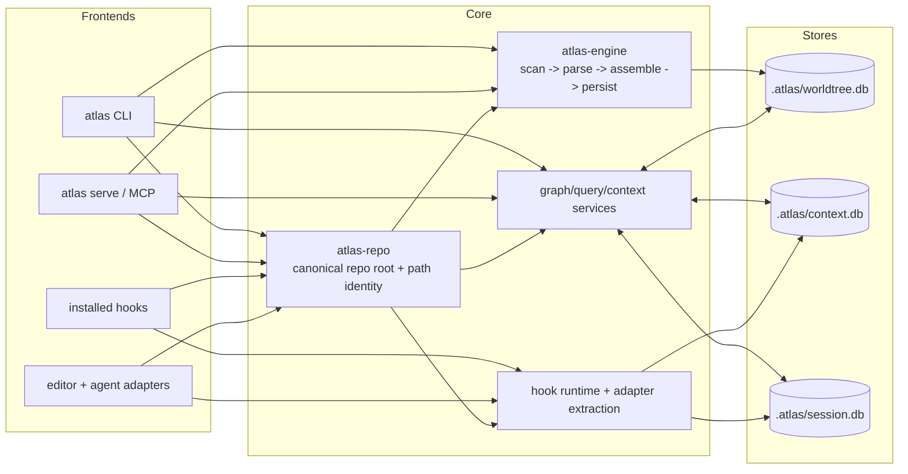

# Atlas Architecture

Atlas keeps graph facts, large artifacts, and session state in separate SQLite files under `.atlas/`. CLI commands, MCP tools, and installed hooks all flow through same core services so repo identity, canonical paths, and storage boundaries stay consistent.

## High-level diagram

## Database roles

### `.atlas/worldtree.db`

Purpose: static repository graph facts.

- file inventory and canonical repo-relative paths
- symbols, edges, ownership, and graph-derived diagnostics
- build/update lifecycle state for graph-backed features

Do not store:

- raw hook payload dumps
- large command output
- session timelines
- prompt/runtime artifact bodies

Writers:

- `atlas-engine::build_graph()`
- `atlas-engine::update_graph()`
- graph maintenance flows such as migrations and postprocess steps

Readers:

- CLI graph commands
- MCP graph/context/review tools
- impact, review, and query services

### `.atlas/context.db`

Purpose: large artifacts and searchable saved context.

- command output previews and pointer-backed payloads
- hook payload artifacts
- saved context chunks and retrieval text
- runtime artifacts too large for session rows

Why separate:

- large text should not bloat graph tables
- retention and chunking policy differ from graph facts
- searchable artifact text can evolve without changing graph schema

### `.atlas/session.db`

Purpose: bounded event ledger and resume continuity.

- session identities
- event metadata and compact payloads
- resume snapshots
- references into `context.db` for large artifacts

Why separate:

- session continuity should survive even when graph is stale
- event retention differs from graph rebuild lifecycle
- session writes are best-effort and must not reshape graph schema

## Atlas-engine pipeline

`atlas-engine` owns graph construction and incremental update. Current flow:

1. Resolve canonical repo root and tracked file set.
2. Read files and parse source in parallel.
3. Assemble nodes, edges, and ownership relationships in memory.
4. Persist graph facts into `worldtree.db` in sequential SQLite write phases.
5. Return build/update summaries for CLI and MCP surfaces.

Important boundary:

- parallel parse phases stay outside SQLite write phases
- path identity comes from `atlas-repo`, not per-command helpers
- graph build/update writes only `worldtree.db`

## Query and context pipeline

Graph-aware queries and review/context commands read from multiple stores, but with distinct roles:

1. resolve canonical repo path or symbol identity
2. read graph facts from `worldtree.db`
3. optionally merge saved artifacts from `context.db`
4. optionally merge session hints from `session.db`
5. emit bounded response to CLI or MCP caller

This keeps retrieval/ranking flexible without turning runtime text into graph truth.

## Adapter and hook boundaries

Adapters and hooks are input surfaces, not alternate storage engines.

- installed hooks read payloads from stdin, sanitize and redact them, then persist through CLI hook runtime
- hook runtime may store large payload bodies in `context.db`
- hook runtime records bounded event metadata in `session.db`
- hooks do not write `worldtree.db` directly
- adapters and MCP surfaces reuse same canonical repo and path rules as CLI

Operational rule:

- graph facts enter through build/update services
- runtime artifacts enter through content/session services
- frontends may enrich context, but must not bypass store boundaries

## Failure isolation

Store split exists so one subsystem can degrade without corrupting others.

- corrupt or stale graph state should block graph-backed answers, not destroy session history
- large artifact routing failures should reduce enrichment quality, not rewrite graph facts
- session persistence failure should not change repository graph identity

## Mental model

Use `worldtree.db` for code truth, `context.db` for large text, and `session.db` for continuity. Frontends differ. Storage contract does not.

## MCP stdio repo resolution in editors

`atlas serve --direct-stdio` has two modes:

- **fixed mode**: `--repo` or `--db` passed. Repo binding happens at startup and ignores client workspace-root changes.
- **dynamic mode**: both `--repo` and `--db` absent. Repo binding is deferred until MCP request evidence or client root hints resolve active workspace root.

Dynamic stdio rule:

- do not trust inherited process cwd for repo identity when client workspace roots are available
- prefer MCP `roots/list` workspace roots
- fall back to repo root discovered from launch cwd only when client roots are unavailable
- cache last successful dynamic root per connection
- invalidate cached dynamic root after `notifications/roots/list_changed`
- fail closed when multi-root evidence is ambiguous

Current dynamic selection precedence:

1. explicit fixed CLI `--repo` / `--db`
2. request-scoped `_meta.atlas.activeRootUri`
3. initialize/session-scoped `_meta.atlas.preferredRootUri`
4. cached active dynamic root
5. deterministic file-evidence inference from tool arguments
6. single advertised root from `roots/list`
7. launch-cwd repo fallback when client roots are unavailable

First-pass limitation:

- query-only multi-root requests without file evidence require validated client hint or explicit fixed `--repo`
- Atlas does not guess active repo from ambiguous relative paths shared by multiple roots; launch-cwd fallback applies only when client roots are unavailable

---

## Graph/Content Companion Contract

Atlas has two coordinated retrieval surfaces: the graph (symbol and relationship data) and the content store (non-code artifacts). These are companion systems operating under one bounded context policy — not a fallback chain and not separate universes.

### Canonical responsibility split

| Surface | Answers |
| ------- | ------- |
| **Graph search** (`query_graph`, `symbol_neighbors`, `traverse_graph`, `get_context`) | Symbols, ownership, callers, callees, tests, imports, and structural relationships |
| **Content lookup** (`search_content`, `search_files`, `search_templates`, `search_text_assets`) | Prompts, docs, config, SQL, templates, logs, and embedded text assets |
| **Saved-context lookup** (`search_saved_context`, `read_saved_context`) | Prior Atlas outputs and session artifacts from `context.db` |
| **Context engine** (`get_context`, `get_review_context`) | Merges both surfaces under one bounded selection, ranking, evidence, and truncation policy |

### When to query both surfaces for one request

- Review of changes that touch config files or templates — both graph (what symbols changed) and content (what config/template text changed)
- Symbols whose behavior depends on prompts or SQL — graph gives structural callers/callees, content gives the embedded text
- Docs/spec questions tied to implementation files — graph gives structural context, content gives the specification
- Agent/task questions that need saved context plus graph facts

### Unified bounded selection policy

Context results mix graph items and content assets under a single priority ordering:

1. **Direct graph targets** — seed nodes resolved from the request, distance=0
2. **Changed files and changed symbols** — nodes and files flagged `changed_symbol=true` from review/impact seeds
3. **Adjacent content assets** — non-code assets (docs, config, templates, SQL) adjacent to changed files or tied to changed symbols
4. **Caller/callee/test evidence** — graph neighbors one or more hops from the seed
5. **Saved-session artifacts** — prior Atlas outputs from `context.db`, only when relevant to the current task

Shared budgets apply across all surfaces in one result:

- `max_nodes` — graph node cap
- `max_edges` — graph edge cap
- `max_content_assets` — non-code file asset cap
- `max_sources` — saved artifact cap
- `max_total_bytes` / `max_tokens` — combined payload cap

Truncation metadata reports omissions per surface:

- `nodes_dropped`, `edges_dropped`, `files_dropped` — graph omissions
- `content_assets_dropped` — non-code asset omissions
- `source_mix` with `items_dropped` per source kind — full budget breakdown

**Deterministic tie-breakers when graph and content scores compete:**

- Graph nodes take priority over content assets at equal relevance score (code structure is primary)
- Among content assets: `adjacent_to_changed_file` > `related_to_changed_symbol` > `content_match`
- Equal-scored graph nodes: alphabetical by `qualified_name`
- Equal-scored content assets: alphabetical by `path`

### Anti-patterns

- Broad file search before graph resolution for symbol questions — use `query_graph` first
- Graph-only review when changed files include config/templates/prompts — also query content
- Content-only answers for structural dependency questions — always check graph first for code relationships
- Separate unbounded result lists from graph and content tools — the context engine applies one shared budget

### Design rule summary

Non-code artifacts are first-class context when they affect behavior. Graph-first does not mean content-blind. The context engine is the merge point; graph and content tools are coordinated inputs to it.
